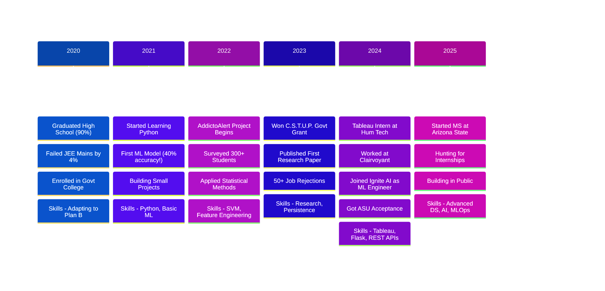

# 👋 Hi, I'm Sakshi Agarwal

<div align="center">
  
### A Data Storyteller in the Making 📊✨

*From Bareilly to Arizona State University | Turning Data into Decisions*

[](https://linkedin.com/in/sakshiagarwal17)
[](mailto:sagar149@asu.edu)

</div>

---

## 🌱 My Journey: From Dreams to Data

<div align="center">



</div>

---

### 📍 **2020: The Year Everything Changed**

<table>
<tr>
<td width="50%">

**🎓 Early 2020: The High**
- Graduated with 90% marks
- Dreams of premier engineering colleges
- Ready to conquer JEE Mains

*Mindset: Confident and hopeful*

</td>
<td width="50%">

**💔 Mid 2020: The Fall**
- Failed JEE Mains by just 4%
- Doors to top colleges closed
- Questioned everything about myself

*Lesson: Sometimes 96% isn't enough*

</td>
</tr>
<tr>
<td colspan="2">

**🎯 Late 2020: The Decision**

Enrolled in a government college in Bareilly. Not my first choice. Not even my backup. But I made a promise to myself: *If I can't walk through the door I wanted, I'll build my own.*

**Skills Developed:** Resilience, Adaptability, Self-motivation

</td>
</tr>
</table>

---

### 📍 **2021-2023: Building From Scratch**

<table>
<tr>
<td width="33%">

**2021: The Foundation** 🏗️

**What I Did:**
- YouTube tutorials at 2 AM
- First Python "Hello World"
- First ML model: 40% accuracy
- Applied to 10+ internships
- Got 10 rejections

**Skills Unlocked:**
- Python basics
- SQL fundamentals  
- ML concepts (theory)
- How to handle rejection

*Status: Confused but curious*

</td>
<td width="33%">

**2022: The Grind** 💪

**What I Did:**
- Built 5+ small projects
- Started AddictoAlert
- Learned data preprocessing  
- Applied to 20+ internships
- Got 20 rejections
- Dove into research papers

**Skills Unlocked:**
- Pandas, NumPy
- Feature engineering
- Survey design
- Statistical analysis
- SVM algorithms

*Status: Frustrated but determined*

</td>
<td width="33%">

**2023: The Validation** ✨

**What I Did:**
- Completed AddictoAlert (300+ participants)
- Won C.S.T.U.P. Govt Grant (beat 150+ applicants)
- Published first paper
- Applied to 20+ companies
- Got 20+ rejections again
- US dream fell through

**Skills Unlocked:**
- Research methodology
- Academic writing
- Machine Learning (SVM)
- Persistence at scale

*Status: Validated but still struggling*

</td>
</tr>
</table>

**2023 Reflections:**
- **Published Paper:** "Unraveling Nomophobia" - Proof that my work mattered beyond grades
- **Dark Reality:** Over 50 total rejections across 3 years. Each one hurt. Each one taught me something.
- **The Pattern:** My government college background was both my biggest obstacle and my greatest motivator

---

### 📍 **2024: The Turning Point**

<table>
<tr>
<td width="50%">

**😰 Jan-Mar: The Desperation Phase**

Applied to 30+ companies in 3 months.

**Reality Check:**
- LinkedIn: "Not a fit"
- Google: Resume rejected
- Meta: Resume rejected  
- Microsoft: Resume rejected
- Startups: "Need more experience"

**The Spiral:**
- Am I good enough?
- Was college choice a mistake?
- Should I give up on ML?

*Lowest Point: Considering switching careers*

</td>
<td width="50%">

**✨ March: First Break**

**Hum Technologies - Tableau Intern**

Someone finally said YES!

**What I Delivered:**
- 5+ dashboards from scratch
- 20% faster monthly reporting
- Learned stakeholder communication

**What I Learned:**
- Presenting data > analyzing data
- Design thinking matters
- I can do this professionally

*First taste of: I belong here*

</td>
</tr>
</table>

<table>
<tr>
<td width="50%">

**😨 Mid-2024: The Anxiety Returns**

Internship ending. No job offer. Bills to pay.

**The Panic:**
- Applied to 20+ companies again
- Savings running low
- Family asking "what's next?"
- US dream still haunting me

**The Questions:**
- Was the internship just luck?
- Can I survive in this field?
- Will anyone hire me full-time?

*Darkest Moment: "Maybe all the projects and papers were for nothing"*

</td>
<td width="50%">

**🎯 The Double Offer**

Two calls in one week:
1. **Clairvoyant** - Tableau Developer
2. **Ignite AI** - ML Engineer

**The Choice:**
Chose Ignite AI. ML was my passion, even when it was hard.

**What I Built:**
- OTIS Central (ML workflow interface)
- REST APIs with Flask
- Presented to engineering leadership

**Skills Mastered:**
- Flask, REST APIs
- MLOps basics
- Professional ML engineering
- Confidence in my abilities

</td>
</tr>
</table>

**Late 2024: Second Chance 🌟**

Got accepted to **Arizona State University**!

The US dream that fell through before? It was just delayed, not denied.

**Decision Made:** Leave job, family, comfort zone. Move to Arizona. Bet on myself again.

---

### 📍 **2025: The Current Chapter**

<div align="center">

**🎓 Arizona State University - MS in Computer Software Engineering**

*Location: Tempe, Arizona 🌵*

</div>

**Where I Am Now:**

| Morning | Afternoon | Evening | Night |
|---------|-----------|---------|-------|
| Classes: Advanced DS, AI, Data Viz | Working with Ignite AI remotely | Building projects | Applying to internships |

**Skills I'm Building:**
- Advanced Algorithms & Data Structures
- Deep Learning & Neural Networks
- AWS & Cloud Computing
- System Design & MLOps
- Building in public (like this README!)

**Current Challenges:**
- Imposter syndrome in a new country ✈️
- Balancing work + studies + internship hunt
- Financial pressure (international student struggles)
- Fighting the rejection cycle again

**What I'm Learning:**
1. Imposter syndrome doesn't disappear with location changes—you just get better at managing it
2. Every "no" is bringing me closer to the right "yes"
3. Building in public is terrifying but necessary
4. The hustle never stops; it just evolves

---

### 💭 Reflections: What This Journey Taught Me

<table>
<tr>
<td width="50%">

**❌ Where I Failed**

- **JEE Mains** → Taught me one test ≠ my worth
- **50+ Rejections** → Taught me persistence
- **40% Accuracy Models** → Taught me iteration
- **First US Attempt** → Taught me patience
- **Self-Doubt Cycles** → Taught me resilience

</td>
<td width="50%">

**✅ Where I Won**

- **Govt Grant** → I can compete with anyone
- **2 Publications** → My research matters
- **Jobs at Hum, Clairvoyant, Ignite** → Timing is everything  
- **ASU Acceptance** → Dreams delayed ≠ denied
- **Still Here** → Survival is success too

</td>
</tr>
</table>

**The Pattern I See:**

```
JEE Failure → Govt College → Had to Stand Out → Built Projects → 
Research Published → More Rejections → Kept Building → 
First Internship → Jobs → ASU → Current Hustle
```

**Nothing was wasted. Every rejection was redirecting me.**

---

<div align="center">

### 🎯 "I'm not where I want to be yet, but I'm grateful I'm not where I used to be."

**From Bareilly to Tempe. From 40% accuracy to published papers. From 50+ rejections to choosing between offers.**

**The journey continues. The hustle never stops. The story isn't over.**

</div>

---

## 🛠️ What I'm Building

### Currently Working On 🔨
- **OTIS Central** (Ignite AI): Building ML workflow management interfaces—integrating REST APIs and making complex data accessible
- **Master's Coursework:** Diving deep into Advanced Data Structures, Data Visualization, and AI for Software Engineers
- **Personal Project:** A dashboard that tracks my learning journey and study patterns (meta, I know! 😄)

### What I've Shipped ✅
- **Data Reconciliation Tool** @ Clairvoyant: Identified 50+ discrepancies, improved data integrity by 30%
- **Automated Dashboards** @ Hum Technologies: Reduced monthly reporting time by 20%
- **Video Game Sales Prediction:** 99.39% accuracy with Decision Tree (yeah, I'm proud of this one!)
- **Two Research Publications:** On body fat prediction and smartphone addiction analysis

---

## 💻 My Tech Toolbox

```python
class SakshiAgarwal:
    def __init__(self):
        self.current_role = "ML Engineer & Graduate Student"
        self.location = "Tempe, Arizona 🌵"
        self.learning = ["Advanced DS", "AI Engineering", "AWS"]
        
    def tech_stack(self):
        return {
            "ml_frameworks": ["TensorFlow", "PyTorch", "Scikit-learn"],
            "languages": ["Python", "SQL", "Java"],
            "visualization": ["Tableau", "Matplotlib", "Plotly"],
            "exploring": ["Cloud Computing", "Deep Learning", "NLP"]
        }
    
    def current_focus(self):
        return "Building ML systems that bridge the gap between data and decisions"
```

**Most Used Languages:**
- 🐍 Python: 60%
- 📊 SQL: 25%
- ☕ Java: 15%

---

## 📈 Growth Mindset

### 2024 Achievements 🎉
- ✅ Started Master's at Arizona State University
- ✅ Published 2 research papers
- ✅ Worked on 3 industry projects
- ✅ Learned to balance work, studies, and self-care

### 2025 Goals 🎯
- [ ] Contribute to 5 open-source ML projects
- [ ] Build a personal portfolio of 10 end-to-end ML projects
- [ ] Master AWS and cloud-based ML deployment
- [ ] Write technical blogs about my learning journey
- [ ] Land a summer internship in ML/AI

---

## 🎓 What I'm Learning

**Right Now:**
- How to design scalable ML systems
- Best practices in MLOps and model deployment
- Advanced visualization techniques for storytelling with data

**Recently Clicked:**
- The importance of feature engineering (it's an art and a science!)
- How to communicate technical concepts to non-technical stakeholders
- That coffee is essential for debugging sessions ☕

---

## 📝 Published Work

1. **"ML-based Investigation of Hybrid Regressor Model for Accurate Body Fat and BMI Prediction"** - IEEE
   - Tackled a healthcare problem using machine learning
   
2. **"Unraveling Nomophobia: An Exploratory Data Analysis using Python"** - ISTE
   - Explored the psychology of smartphone addiction through data

---

## 🤝 Let's Connect!

I'm always excited to collaborate on:
- 🤖 Machine Learning projects with social impact
- 📊 Data visualization that tells compelling stories
- 🔬 Research in applied ML and behavioral analysis
- 💡 Open-source contributions

**Fun Fact:** I believe the best ML models are built with empathy—understanding not just the data, but the people behind it.

---

<div align="center">

### "Data is just numbers until you find the story it wants to tell" 📖

**Let's build something amazing together!**


</div>
